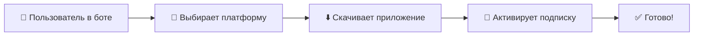

# 🚀 YoVPN WebApp - Modern Telegram Mini App

<div align="center">


**Современный Telegram Mini App для активации VPN-подписок v2raytun**

[](https://nextjs.org/)
[](https://react.dev/)
[](https://www.typescriptlang.org/)
[](https://fastapi.tiangolo.com/)
[](https://tailwindcss.com/)
[](https://greensock.com/)

[Демо](#-демонстрация) • [Документация](#-документация) • [Быстрый старт](#-быстрый-старт) • [Деплой](#-деплой)

</div>

---

## 📖 Содержание

- [О проекте](#-о-проекте)
- [Особенности](#-особенности)
- [Демонстрация](#-демонстрация)
- [Архитектура](#-архитектура)
- [Быстрый старт](#-быстрый-старт)
- [Структура проекта](#-структура-проекта)
- [API документация](#-api-документация)
- [Поддерживаемые платформы](#-поддерживаемые-платформы)
- [Режим разработчика](#-режим-разработчика)
- [Деплой](#-деплой)
- [Contributing](#-contributing)

---

## 🎯 О проекте

**YoVPN WebApp** — это полноценное решение для активации VPN-подписок через Telegram Mini App, созданное с акцентом на UX, производительность и современный дизайн в стиле 2025-2026 года.

### Что делает WebApp?

Пользователь проходит **3 простых шага**:



1. **Выбор платформы** — Android, iOS, macOS, Windows, Android TV
2. **Скачивание** — Автоматическое открытие ссылки на скачивание
3. **Активация** — URI копируется и приложение открывается автоматически

### Почему это круто?

- ⚡ **1-Click Activation** — подписка активируется в один клик
- 🎨 **Современный UI** — Glassmorphism, плавные GSAP-анимации
- 📱 **PWA** — Работает как нативное приложение
- 🔐 **Безопасно** — HMAC-SHA256 валидация Telegram данных
- 🌐 **Кросс-платформенно** — 5 платформ в одном месте
- 🛠️ **Dev Mode** — Тестирование без Telegram

---

## ✨ Особенности

### 🎨 UI/UX Тренды 2025-2026

| Особенность | Описание |
|------------|----------|
| **Glassmorphism** | Полупрозрачные элементы с backdrop-blur |
| **GSAP Анимации** | Плавные fade-in, slide-up, parallax эффекты |
| **Apple-style Design** | Минимализм, чистое пространство, акценты |
| **Micro-animations** | Hover эффекты, glow, shimmer |
| **Dark/Light Theme** | Автоопределение темы из Telegram |
| **Responsive** | Mobile-first, адаптация под все экраны |

### ⚡ Технологический стек

#### Frontend
- **Next.js 15** — App Router, Server Components, ISR
- **React 18** — Hooks, Suspense, Concurrent Features
- **TypeScript 5** — Строгая типизация
- **Tailwind CSS 3** — Утилитарные стили
- **GSAP 3** — Профессиональные анимации
- **Zustand** — Легковесный state management

#### Backend
- **FastAPI** — Async Python framework
- **Pydantic** — Валидация данных
- **Uvicorn** — ASGI сервер
- **HTTPX** — Async HTTP клиент

#### DevOps
- **Docker** — Контейнеризация
- **Nginx** — Reverse proxy
- **PM2** — Process manager
- **Vercel/Railway** — Cloud hosting

### 🔐 Безопасность

- ✅ **HMAC-SHA256** валидация init_data от Telegram
- ✅ **CORS** защита с whitelist доменов
- ✅ **Environment variables** для секретов
- ✅ **Rate limiting** (опционально)
- ✅ **HTTPS only** в production

### 📱 PWA Функции

- ✅ **Offline режим** — Service Worker кэширование
- ✅ **Installable** — Установка на домашний экран
- ✅ **Web Manifest** — Иконки, splash screen
- ✅ **Push Notifications** (опционально)

---

## 🎬 Демонстрация

### Скриншоты

<details>
<summary>📱 Шаг 1: Выбор платформы</summary>

```
┌─────────────────────────────────────────────────────┐
│                                                     │
│           Выберите платформу                        │
│                                                     │
│   ┌─────┐  ┌─────┐  ┌─────┐  ┌─────┐  ┌─────┐    │
│   │ 📱  │  │ 🍎  │  │ 💻  │  │ 🪟  │  │ 📺  │    │
│   │     │  │     │  │     │  │     │  │     │    │
│   │ AND │  │ iOS │  │ MAC │  │ WIN │  │ TV  │    │
│   │     │  │     │  │     │  │     │  │     │    │
│   └─────┘  └─────┘  └─────┘  └─────┘  └─────┘    │
│                                                     │
│   Glassmorphism + GSAP Hover Effects ✨            │
│                                                     │
└─────────────────────────────────────────────────────┘
```

**Анимации:**
- Fade-in с stagger эффектом
- 3D parallax при наведении
- Glow эффект на выбранной карточке
- Smooth transition к следующему шагу

</details>

<details>
<summary>⬇️ Шаг 2: Скачивание приложения</summary>

```
┌─────────────────────────────────────────────────────┐
│                                                     │
│               📱 Android                            │
│                                                     │
│     Скачайте v2raytun для Android                  │
│                                                     │
│   ┌───────────────────────────────────────┐        │
│   │   📥  Скачать приложение              │        │
│   └───────────────────────────────────────┘        │
│                                                     │
│   ┌───────────────────────────────────────┐        │
│   │ Загрузка...                     75%   │        │
│   │ ▓▓▓▓▓▓▓▓▓▓▓▓▓▓▓░░░░░             │        │
│   │ shimmer effect →                      │        │
│   └───────────────────────────────────────┘        │
│                                                     │
│   📋 Инструкция:                                   │
│   1. Нажмите кнопку скачивания                     │
│   2. Установите приложение                         │
│   3. Вернитесь для активации                       │
│                                                     │
└─────────────────────────────────────────────────────┘
```

**Анимации:**
- Progress bar с shimmer эффектом
- Rotating spinner
- Success checkmark animation
- Auto-transition после завершения

</details>

<details>
<summary>🔗 Шаг 3: Активация подписки</summary>

```
┌─────────────────────────────────────────────────────┐
│                                                     │
│           🔗 Активация подписки                     │
│                                                     │
│   ┌───────────────────────────────────────┐        │
│   │   🚀  Активировать подписку           │        │
│   │       glow effect                     │        │
│   └───────────────────────────────────────┘        │
│                                                     │
│   ┌───────────────────────────────────────┐        │
│   │   📋  Скопировать URI вручную         │        │
│   └───────────────────────────────────────┘        │
│                                                     │
│   ✅ Подписка активирована!                        │
│                                                     │
│   ℹ️  Информация:                                  │
│   • Платформа: Android                             │
│   • Статус: ✓ Активна                              │
│   • Действует до: 31.12.2025                       │
│                                                     │
└─────────────────────────────────────────────────────┘
```

**Анимации:**
- Pulse glow на кнопке активации
- Confetti animation при успехе
- Scale-in для success message
- Haptic feedback (в Telegram)

</details>

### 🎥 GIF Демонстрация анимаций

Создайте GIF используя:
```bash
# Screen recording → GIF
# 1. Запишите экран (QuickTime, OBS, etc.)
# 2. Конвертируйте в GIF:
ffmpeg -i screen-recording.mov -vf "fps=30,scale=800:-1:flags=lanczos" -c:v gif demo.gif
```

**Рекомендуемые сцены для GIF:**

1. **`platform-selection.gif`** — Выбор платформы с анимациями
2. **`download-progress.gif`** — Progress bar с shimmer
3. **`activation-success.gif`** — Успешная активация с конфетти
4. **`theme-switch.gif`** — Переключение dark/light темы
5. **`dev-mode.gif`** — Работа режима разработчика

Разместите GIF в `webapp/public/demo/` и обновите README:

```markdown

```

---

## 🏗️ Архитектура

### Общая схема

```
┌─────────────────────────────────────────────────────────┐
│                    Telegram User                        │
└───────────────────┬─────────────────────────────────────┘
                    │
                    ▼
┌─────────────────────────────────────────────────────────┐
│                 Telegram Bot API                        │
│  ┌─────────────────────────────────────────────────┐   │
│  │  WebApp Handler (/webapp command)               │   │
│  │  • Sends WebApp button                          │   │
│  │  • Provides init_data                           │   │
│  └─────────────────────────────────────────────────┘   │
└───────────────────┬─────────────────────────────────────┘
                    │
                    ▼
┌─────────────────────────────────────────────────────────┐
│              Next.js Frontend (WebApp)                  │
│  ┌──────────────────────────────────────────────────┐  │
│  │  Components Layer                                │  │
│  │  • PlatformSelector (Step 1)                     │  │
│  │  • DownloadStep (Step 2)                         │  │
│  │  • ActivationStep (Step 3)                       │  │
│  │  • ThemeProvider, DevModeToggle                  │  │
│  └──────────────────────────────────────────────────┘  │
│  ┌──────────────────────────────────────────────────┐  │
│  │  State Management (Zustand)                      │  │
│  │  • currentStep, selectedPlatform                 │  │
│  │  • subscription, theme, devMode                  │  │
│  └──────────────────────────────────────────────────┘  │
│  ┌──────────────────────────────────────────────────┐  │
│  │  Hooks Layer                                     │  │
│  │  • useTelegram() - WebApp API integration        │  │
│  │  • useStore() - State management                 │  │
│  └──────────────────────────────────────────────────┘  │
│  ┌──────────────────────────────────────────────────┐  │
│  │  Lib/Utils Layer                                 │  │
│  │  • API client (axios)                            │  │
│  │  • Utils (clipboard, deeplink)                   │  │
│  │  • Constants, Types                              │  │
│  └──────────────────────────────────────────────────┘  │
└───────────────────┬─────────────────────────────────────┘
                    │ HTTPS/REST API
                    ▼
┌─────────────────────────────────────────────────────────┐
│              FastAPI Backend (API)                      │
│  ┌──────────────────────────────────────────────────┐  │
│  │  Routes Layer                                    │  │
│  │  • POST /api/validate - Validate init_data       │  │
│  │  • GET  /api/subscription/:id - Get subscription │  │
│  │  • GET  /api/version/:platform - Get version     │  │
│  │  • POST /api/track/activation - Track event      │  │
│  └──────────────────────────────────────────────────┘  │
│  ┌──────────────────────────────────────────────────┐  │
│  │  Services Layer                                  │  │
│  │  • SubscriptionService - Business logic          │  │
│  │  • Integration with Marzban API                  │  │
│  └──────────────────────────────────────────────────┘  │
│  ┌──────────────────────────────────────────────────┐  │
│  │  Utils Layer                                     │  │
│  │  • Telegram validation (HMAC-SHA256)             │  │
│  │  • Security helpers                              │  │
│  └──────────────────────────────────────────────────┘  │
└───────────────────┬─────────────────────────────────────┘
                    │
                    ▼
┌─────────────────────────────────────────────────────────┐
│                 Marzban API / Database                  │
│  • User subscriptions                                   │
│  • Subscription URIs                                    │
│  • Expiration dates                                     │
└─────────────────────────────────────────────────────────┘
```

### Data Flow

```
User Action → Telegram WebApp → API Request → Backend Validation
     ↓              ↓                ↓                ↓
  Click        Init Data       Auth Header      HMAC Check
     ↓              ↓                ↓                ↓
  GSAP         Zustand         Axios/HTTPX      Pydantic
Animation      Update          Request          Validation
     ↓              ↓                ↓                ↓
  UI Update    State Change    Response         Success/Error
```

---

## 🚀 Быстрый старт

### Требования

Убедитесь, что установлено:

- **Node.js 18+** — [Скачать](https://nodejs.org/)
- **Python 3.11+** — [Скачать](https://www.python.org/)
- **npm 9+** — Устанавливается с Node.js
- **Git** — [Скачать](https://git-scm.com/)

Проверка версий:
```bash
node --version   # v18.0.0+
python3 --version # Python 3.11+
npm --version    # 9.0.0+
```

### Автоматический запуск (⚡ Рекомендуется)

```bash
# 1. Клонируйте репозиторий
git clone https://github.com/yourusername/yovpn.git
cd yovpn

# 2. Запустите WebApp
./start-webapp.sh
```

**Готово!** 🎉

- 📱 **Frontend**: http://localhost:3000
- 🔌 **Backend**: http://localhost:8000
- 📚 **API Docs**: http://localhost:8000/docs

### Ручной запуск

<details>
<summary>Развернуть инструкцию</summary>

#### Terminal 1: Frontend

```bash
cd webapp

# Установка зависимостей
npm install

# Копирование env файла
cp .env.example .env.local

# Запуск dev сервера
npm run dev
```

Frontend запустится на http://localhost:3000

#### Terminal 2: Backend

```bash
cd api

# Создание виртуального окружения
python3 -m venv venv
source venv/bin/activate  # Windows: venv\Scripts\activate

# Установка зависимостей
pip install -r requirements.txt

# Копирование env файла
cp .env.example .env

# Запуск сервера
python -m app.main
```

Backend запустится на http://localhost:8000

</details>

### Остановка

```bash
./stop-webapp.sh
```

Или вручную:
```bash
pkill -f "next-server"
pkill -f "uvicorn"
```

---

## 📁 Структура проекта

### Frontend (webapp/)

```
webapp/
├── src/
│   ├── app/                    # Next.js 15 App Router
│   │   ├── layout.tsx          # Root layout с Telegram SDK
│   │   └── page.tsx            # Главная страница
│   │
│   ├── components/             # React компоненты
│   │   ├── PlatformSelector.tsx    # Шаг 1: Выбор платформы
│   │   ├── DownloadStep.tsx        # Шаг 2: Скачивание
│   │   ├── ActivationStep.tsx      # Шаг 3: Активация
│   │   ├── MainApp.tsx             # Главный компонент
│   │   ├── ThemeProvider.tsx       # Управление темой
│   │   └── DevModeToggle.tsx       # Dev режим
│   │
│   ├── hooks/                  # Custom React Hooks
│   │   ├── useTelegram.ts      # Интеграция с Telegram WebApp API
│   │   │                       # • webApp, user, hapticFeedback
│   │   │                       # • showMainButton, showBackButton
│   │   │                       # • colorScheme detection
│   │   │
│   │   └── useStore.ts         # Zustand State Management
│   │                           # • currentStep, selectedPlatform
│   │                           # • subscription, theme, devMode
│   │
│   ├── lib/                    # Библиотеки и утилиты
│   │   ├── api.ts              # API клиент (axios)
│   │   │                       # • getSubscription()
│   │   │                       # • validateTelegramData()
│   │   │                       # • trackActivation()
│   │   │
│   │   ├── constants.ts        # Константы приложения
│   │   │                       # • PLATFORMS конфигурация
│   │   │                       # • ANIMATION_DURATION, THEME_COLORS
│   │   │
│   │   ├── utils.ts            # Утилиты
│   │   │                       # • copyToClipboard()
│   │   │                       # • openDeepLink()
│   │   │                       # • detectUserPlatform()
│   │   │
│   │   └── pwa.ts              # PWA функции
│   │                           # • registerServiceWorker()
│   │
│   ├── types/                  # TypeScript типы
│   │   └── index.ts            # Все интерфейсы и типы
│   │                           # • Platform, Step, Subscription
│   │                           # • TelegramWebApp, ApiResponse
│   │
│   └── styles/                 # Стили
│       └── globals.css         # Глобальные стили
│                               # • Glassmorphism классы
│                               # • Анимации (keyframes)
│                               # • Кастомные утилиты
│
├── public/                     # Статические файлы
│   ├── manifest.json           # PWA manifest
│   ├── sw.js                   # Service Worker
│   ├── icons/                  # PWA иконки
│   │   ├── icon-72x72.png
│   │   ├── icon-192x192.png
│   │   └── icon-512x512.png
│   └── images/                 # Изображения
│
├── package.json                # Dependencies
├── tsconfig.json               # TypeScript config
├── tailwind.config.ts          # Tailwind config
├── next.config.js              # Next.js config
└── README.md                   # Frontend документация
```

### Backend (api/)

```
api/
├── app/
│   ├── routes/                 # API endpoints
│   │   └── api.py              # Все роуты
│   │                           # • POST /api/validate
│   │                           # • GET  /api/subscription/:userId
│   │                           # • GET  /api/version/:platform
│   │                           # • POST /api/track/activation
│   │
│   ├── models/                 # Data models
│   │   └── schemas.py          # Pydantic схемы
│   │                           # • TelegramInitData
│   │                           # • SubscriptionResponse
│   │                           # • VersionResponse
│   │
│   ├── services/               # Бизнес-логика
│   │   └── subscription_service.py
│   │                           # • get_subscription_uri()
│   │                           # • track_activation()
│   │                           # • Integration с Marzban
│   │
│   ├── utils/                  # Утилиты
│   │   └── telegram.py         # Telegram валидация
│   │                           # • validate_telegram_init_data()
│   │                           # • HMAC-SHA256 verification
│   │
│   ├── config.py               # Конфигурация
│   │                           # • Settings (Pydantic)
│   │                           # • Environment variables
│   │
│   └── main.py                 # FastAPI приложение
│                               # • CORS middleware
│                               # • Routers registration
│
├── requirements.txt            # Python dependencies
├── Dockerfile                  # Docker config
└── README.md                   # Backend документация
```

### Bot Integration

```
bot/handlers/
└── webapp_handler.py           # WebApp handler
                                # • /webapp команда
                                # • WebAppInfo кнопка
                                # • Callback handlers
```

### DevOps

```
/
├── docker-compose.webapp.yml   # Docker Compose конфиг
├── nginx.conf                  # Nginx reverse proxy
├── start-webapp.sh            # Скрипт запуска
├── stop-webapp.sh             # Скрипт остановки
└── Dockerfile                  # Docker configs
```

---

## 📡 API документация

### Base URL

```
Development:  http://localhost:8000
Production:   https://api.yourdomain.com
```

### Endpoints

#### 1. Health Check

```http
GET /api/health
```

**Response:**
```json
{
  "status": "healthy",
  "service": "YoVPN WebApp API"
}
```

**cURL:**
```bash
curl http://localhost:8000/api/health
```

---

#### 2. Validate Telegram Data

Проверяет подлинность init_data от Telegram.

```http
POST /api/validate
Content-Type: application/json

{
  "init_data": "query_id=xxx&user=xxx&auth_date=xxx&hash=xxx"
}
```

**Response (Success):**
```json
{
  "valid": true,
  "user_id": 123456789
}
```

**Response (Error):**
```json
{
  "valid": false,
  "user_id": null
}
```

**cURL:**
```bash
curl -X POST http://localhost:8000/api/validate \
  -H "Content-Type: application/json" \
  -d '{
    "init_data": "query_id=AAG..."
  }'
```

---

#### 3. Get Subscription

Получить подписку пользователя.

```http
GET /api/subscription/{user_id}
X-Telegram-Init-Data: query_id=xxx&user=xxx&auth_date=xxx&hash=xxx
```

**Response (Success):**
```json
{
  "user_id": 123456789,
  "subscription_uri": "v2ray://eyJhZGQiOiAiMTkyLjE2...",
  "expires_at": "2025-12-31T23:59:59",
  "is_active": true,
  "subscription_type": "premium"
}
```

**Response (Error):**
```json
{
  "detail": "Subscription not found"
}
```

**cURL:**
```bash
curl http://localhost:8000/api/subscription/123456789 \
  -H "X-Telegram-Init-Data: query_id=AAG..."
```

**JavaScript (Axios):**
```javascript
import axios from 'axios';

const response = await axios.get('/api/subscription/123456789', {
  headers: {
    'X-Telegram-Init-Data': window.Telegram.WebApp.initData
  }
});

console.log(response.data);
// { user_id: 123456789, subscription_uri: "v2ray://...", ... }
```

---

#### 4. Get Latest Version

Получить последнюю версию приложения для платформы.

```http
GET /api/version/{platform}
```

**Platforms:** `android` | `ios` | `macos` | `windows` | `androidtv`

**Response:**
```json
{
  "platform": "android",
  "version": "latest",
  "download_url": "https://github.com/yovpn/v2raytun/releases/latest/download/v2raytun-android.apk",
  "release_date": null
}
```

**cURL:**
```bash
curl http://localhost:8000/api/version/android
```

---

#### 5. Track Activation

Отслеживание события активации подписки.

```http
POST /api/track/activation
Content-Type: application/json
X-Telegram-Init-Data: query_id=xxx&user=xxx&auth_date=xxx&hash=xxx

{
  "user_id": 123456789,
  "platform": "android"
}
```

**Response:**
```json
{
  "success": true,
  "message": "Activation tracked successfully"
}
```

**cURL:**
```bash
curl -X POST http://localhost:8000/api/track/activation \
  -H "Content-Type: application/json" \
  -H "X-Telegram-Init-Data: query_id=AAG..." \
  -d '{
    "user_id": 123456789,
    "platform": "android"
  }'
```

**JavaScript:**
```javascript
const response = await axios.post('/api/track/activation', {
  user_id: 123456789,
  platform: 'android'
}, {
  headers: {
    'X-Telegram-Init-Data': window.Telegram.WebApp.initData
  }
});
```

---

### Authentication

API использует **Telegram init_data** для аутентификации:

1. Frontend получает `init_data` от Telegram WebApp
2. Отправляет в заголовке `X-Telegram-Init-Data`
3. Backend проверяет HMAC-SHA256 подпись
4. Извлекает user_id и другие данные

**Пример проверки (Python):**
```python
import hmac
import hashlib

def validate_init_data(init_data: str, bot_token: str) -> bool:
    parsed_data = dict(parse_qsl(init_data))
    received_hash = parsed_data.pop('hash')
    
    data_check_string = '\n'.join(
        f"{k}={v}" for k, v in sorted(parsed_data.items())
    )
    
    secret_key = hmac.new(
        "WebAppData".encode(),
        bot_token.encode(),
        hashlib.sha256
    ).digest()
    
    calculated_hash = hmac.new(
        secret_key,
        data_check_string.encode(),
        hashlib.sha256
    ).hexdigest()
    
    return hmac.compare_digest(calculated_hash, received_hash)
```

---

## 📱 Поддерживаемые платформы

### Все платформы

| Платформа | Иконка | Описание | Download URL |
|-----------|--------|----------|--------------|
| **Android** | 📱 | Android 5.0+ | [APK на GitHub](https://github.com/yovpn/v2raytun/releases) |
| **iOS** | 🍎 | iOS 13+ | [App Store](https://apps.apple.com/app/v2raytun) |
| **macOS** | 💻 | macOS 11+ | [DMG на GitHub](https://github.com/yovpn/v2raytun/releases) |
| **Windows** | 🪟 | Windows 10+ | [EXE на GitHub](https://github.com/yovpn/v2raytun/releases) |
| **Android TV** | 📺 | Android TV 9+ | [APK TV на GitHub](https://github.com/yovpn/v2raytun/releases) |

### Deep Link поддержка

Каждая платформа поддерживает автоматическое открытие через URI:

```
v2raytun://import/{encoded_subscription_uri}
```

**Примеры:**

```javascript
// Android
const deepLink = `v2raytun://import/${encodeURIComponent(subscriptionUri)}`;
window.location.href = deepLink;

// iOS (Universal Links)
const universalLink = `https://v2raytun.app/import?uri=${encodeURIComponent(subscriptionUri)}`;

// Fallback: clipboard
navigator.clipboard.writeText(subscriptionUri);
```

### Добавление новой платформы

1. Добавьте в `webapp/src/lib/constants.ts`:

```typescript
export const PLATFORMS: PlatformConfig[] = [
  // ... existing platforms
  {
    id: 'linux',
    name: 'Linux',
    icon: '🐧',
    downloadUrl: 'https://github.com/.../v2raytun-linux.AppImage',
    description: 'Download for Linux',
  },
];
```

2. Добавьте environment variable:

```env
NEXT_PUBLIC_LINUX_APPIMAGE_URL=https://github.com/.../v2raytun-linux.AppImage
```

3. Обновите backend:

```python
# api/app/routes/api.py
platform_urls = {
    # ... existing platforms
    'linux': settings.linux_appimage_url,
}
```

---

## 🛠️ Режим разработчика

### Что это?

**Dev Mode** позволяет тестировать WebApp **без Telegram**, используя моковые данные.

### Активация

1. В файле `webapp/.env.local`:

```env
NEXT_PUBLIC_DEV_MODE=true
```

2. Перезапустите frontend:

```bash
npm run dev
```

### Использование

1. Откройте http://localhost:3000
2. Нажмите кнопку **🛠️** в правом нижнем углу
3. Настройки Dev Mode:

```
┌─────────────────────────────────────┐
│  🛠️ Dev Mode                        │
├─────────────────────────────────────┤
│                                     │
│  Mock User ID:                      │
│  ┌───────────────────────────────┐ │
│  │ 123456789                     │ │
│  └───────────────────────────────┘ │
│                                     │
│  Mock Subscription URI:             │
│  ┌───────────────────────────────┐ │
│  │ v2ray://eyJhZGQiOiI...       │ │
│  │                               │ │
│  └───────────────────────────────┘ │
│                                     │
│  ┌───────────────────────────────┐ │
│  │      Save Settings            │ │
│  └───────────────────────────────┘ │
│                                     │
│  ⚠️ Development Mode is enabled    │
│                                     │
└─────────────────────────────────────┘
```

4. Сохраните и тестируйте все функции!

### Примеры тестовых данных

```javascript
// Mock User
{
  id: 123456789,
  first_name: "Test",
  last_name: "User",
  username: "testuser"
}

// Mock Subscription URI
"v2ray://eyJhZGQiOiIxOTIuMTY4LjEuMSIsInBvcnQiOjEwODAsImFpZCI6MCwibmV0Ijoid3MiLCJ0eXBlIjoibm9uZSIsImhvc3QiOiIiLCJwYXRoIjoiLyIsInRscyI6IiJ9"

// Mock Subscription Response
{
  user_id: 123456789,
  subscription_uri: "v2ray://...",
  expires_at: "2025-12-31T23:59:59",
  is_active: true,
  subscription_type: "premium"
}
```

### Dev Mode API

В режиме разработки API возвращает моковые данные:

```python
# api/app/services/subscription_service.py
if not self.marzban_service or not self.user_service:
    # Mock data for development
    return {
        'user_id': user_id,
        'subscription_uri': f'v2ray://mock-subscription-{user_id}',
        'expires_at': (datetime.now() + timedelta(days=30)).isoformat(),
        'is_active': True,
        'subscription_type': 'premium'
    }
```

---

## 🌐 Деплой

### Быстрые варианты

| Платформа | Время | Сложность | Стоимость |
|-----------|-------|-----------|-----------|
| [Vercel + Railway](#vercel--railway) | 5 мин | ⭐ Легко | Free tier |
| [Docker Compose](#docker-compose) | 10 мин | ⭐⭐ Средне | VPS (~$5/мес) |
| [VPS (Ubuntu)](#vps-ubuntu) | 30 мин | ⭐⭐⭐ Сложно | VPS (~$5/мес) |

### Vercel + Railway

**Самый быстрый способ!**

#### Frontend на Vercel

```bash
cd webapp
npm install -g vercel
vercel login
vercel --prod
```

В Vercel Dashboard:
- Settings → Environment Variables
- Добавьте все переменные из `.env.production`

#### Backend на Railway

1. Откройте [railway.app](https://railway.app)
2. New Project → Deploy from GitHub
3. Root Directory: `api`
4. Start Command: `uvicorn app.main:app --host 0.0.0.0 --port $PORT`
5. Variables → добавьте env переменные

**Готово!** Получите URL и обновите `WEBAPP_URL` в боте.

### Docker Compose

```bash
# 1. Клонируйте репозиторий
git clone https://github.com/yourusername/yovpn.git
cd yovpn

# 2. Настройте .env
cp .env.example .env
nano .env

# 3. Запустите
docker-compose -f docker-compose.webapp.yml up -d

# 4. Проверьте
docker-compose -f docker-compose.webapp.yml ps
```

### Полная документация

См. [DEPLOYMENT.md](./DEPLOYMENT.md) для детальных инструкций.

---

## 🤝 Contributing

Contributions приветствуются! 🎉

### Как помочь проекту:

1. **Fork** репозиторий
2. Создайте **feature branch**:
   ```bash
   git checkout -b feature/amazing-feature
   ```
3. **Commit** изменения:
   ```bash
   git commit -m 'Add amazing feature'
   ```
4. **Push** в branch:
   ```bash
   git push origin feature/amazing-feature
   ```
5. Откройте **Pull Request**

### Code Style

- **Frontend**: ESLint + Prettier
- **Backend**: Black + isort
- **Commits**: Conventional Commits

```bash
# Frontend
npm run lint
npm run format

# Backend
black .
isort .
```

### Тестирование

```bash
# Frontend
npm test
npm run build  # Проверка production build

# Backend
pytest
```

---

## 📄 Лицензия

MIT License - см. [LICENSE](LICENSE)

```
MIT License

Copyright (c) 2024 YoVPN

Permission is hereby granted, free of charge, to any person obtaining a copy
of this software and associated documentation files (the "Software"), to deal
in the Software without restriction...
```

---

## 📞 Поддержка

### Нужна помощь?

- 📖 **Документация**: [WEBAPP_GUIDE.md](./WEBAPP_GUIDE.md)
- 🐛 **Bug Reports**: [GitHub Issues](https://github.com/yourusername/yovpn/issues)
- 💬 **Telegram**: [@yovpn_support](https://t.me/yovpn_support)
- ✉️ **Email**: support@yovpn.com

### FAQ

<details>
<summary>WebApp не открывается в Telegram</summary>

**Решение:**
1. Проверьте HTTPS (Telegram требует HTTPS)
2. Убедитесь что `telegram-web-app.js` загружен
3. Проверьте консоль браузера в Telegram
</details>

<details>
<summary>API возвращает 401 Unauthorized</summary>

**Решение:**
1. Проверьте `X-Telegram-Init-Data` заголовок
2. Убедитесь что `TELEGRAM_BOT_TOKEN` правильный
3. Проверьте HMAC валидацию
</details>

<details>
<summary>Анимации тормозят</summary>

**Решение:**
1. Используйте `will-change: transform` в CSS
2. Оптимизируйте GSAP анимации (уменьшите duration)
3. Проверьте производительность в DevTools
</details>

---

## 🙏 Благодарности

Проект использует следующие технологии:

- [Next.js](https://nextjs.org/) - The React Framework
- [FastAPI](https://fastapi.tiangolo.com/) - Modern Python Web Framework
- [GSAP](https://greensock.com/) - Professional-grade Animation
- [Tailwind CSS](https://tailwindcss.com/) - Utility-first CSS
- [Telegram Bot API](https://core.telegram.org/bots/webapps) - WebApp Platform
- [Vercel](https://vercel.com/) - Deployment Platform
- [Railway](https://railway.app/) - Backend Hosting

Особая благодарность:
- Telegram Team за WebApp API
- GSAP Team за потрясающую библиотеку анимаций
- Next.js Team за React framework будущего

---

## 🗺️ Roadmap

### ✅ Версия 1.0 (Текущая)

- [x] Базовый функционал (3 шага)
- [x] GSAP анимации
- [x] Glassmorphism UI
- [x] PWA поддержка
- [x] Dev режим
- [x] Docker поддержка
- [x] Полная документация

### 🚧 Версия 1.1 (В разработке)

- [ ] A/B тестирование UI/UX
- [ ] Google Analytics интеграция
- [ ] Improved error handling
- [ ] Rate limiting
- [ ] Redis кэширование

### 🔮 Версия 2.0 (Планируется)

- [ ] Мультиязычность (i18n)
- [ ] WebSocket для real-time статусов
- [ ] Push notifications
- [ ] Advanced analytics dashboard
- [ ] QR code subscription import
- [ ] В-app purchases (для Premium)

---

<div align="center">

## ⭐ Star us on GitHub!

Если проект оказался полезным, поставьте звезду ⭐

[](https://github.com/yourusername/yovpn/stargazers)

---

**Создано с ❤️ для YoVPN**

*Modern VPN Service with Focus on UX & Security*

[Документация](./WEBAPP_GUIDE.md) • [Быстрый старт](#-быстрый-старт) • [Деплой](#-деплой) • [Contributing](#-contributing)

</div>
